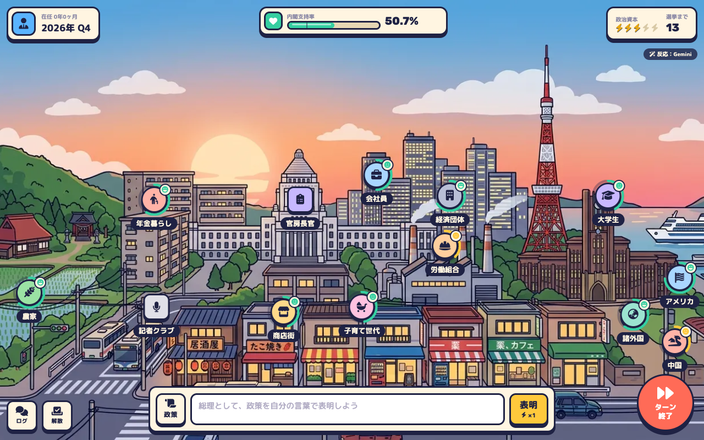
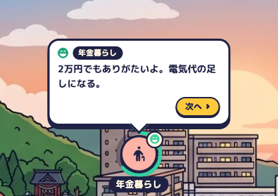
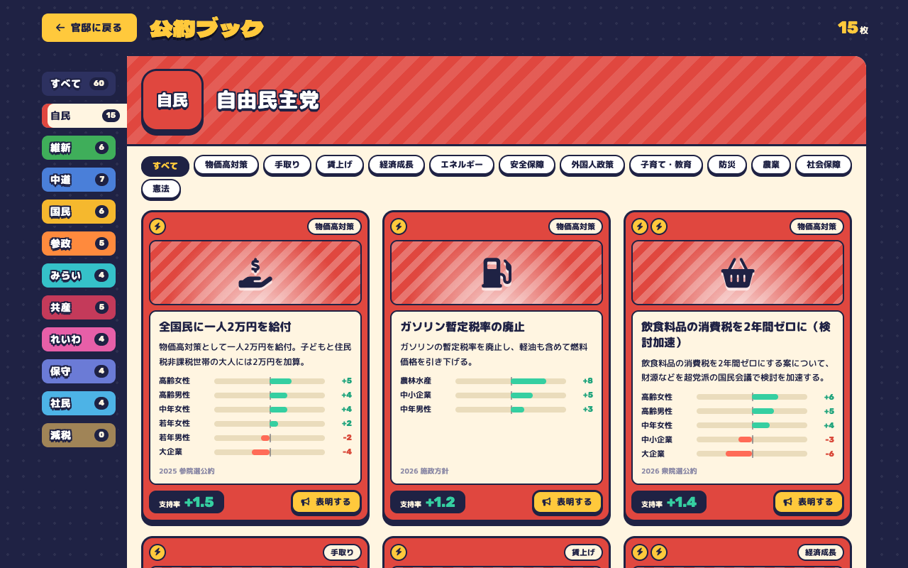
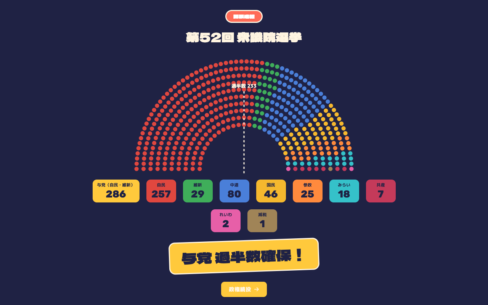

# もしも政治

**あなたが総理なら、この国を何年もたせられる？**

日本の総理大臣になって、政策を自分の言葉で表明する政治シミュレーションゲームです。表明すると、街の人・業界団体・外国がその場で反応し、支持率が動きます。危機や陳情に応えながら、できるだけ長く政権を保つことを目指します。


> これはフィクションのシミュレーションです。公約データは実在の政党の公約の要旨をもとにしていますが、反応や支持率の変化はゲーム用の仮定で、実際の世論や政策の効果を示すものではありません。

## 特徴

- **自由文で政策を表明**：各党の公約データ（11政党・60件）とキーワードで照合し、当たった政策の反応を出します。どの公約にも当たらない表明には、Gemini が街の人の反応を作ります。
- **行動経済学・ゲーム理論にもとづく支持率**：損失回避、組織された団体の声の大きさ、言い回しの効果、慣れ、財政のツケ、バンドワゴン、約束と信頼、連立相手との関係、関税の報復合戦などを計算に入れています。
- **数値はエンジンで確定**：Gemini が作るのはセリフと「素の値」だけです。値の範囲を収め、支持率を計算するのはエンジン（TypeScript）です。
- **1ターンは四半期**：2026年Q4から始まり、支持率が2ターン続けて20%を切るか、選挙で過半数を割ると失脚です。

## 遊ぶ

- **ブラウザで**：https://moshimo-seiji.vercel.app/
- **Claude で**：下の「[Claude のスキルとして遊ぶ](#claude-のスキルとして遊ぶ)」を見てください。

## 遊び方

### 1. 組閣する
タイトルで「組閣する」を押すと、就任の新聞が出ます。「官邸へ」で街の画面に移ります。


### 2. 街を見る
街の人・業界団体・外国が、それぞれの場所にいます。アイコンのまわりの輪が、その人たちの支持の高さです。上には在任期間、内閣支持率、政治資本（1ターンに表明できる回数）、次の選挙までのターン数が出ます。



### 3. 政策を表明する
下の入力欄に、政策を自分の言葉で書いて「表明」を押します（Enter でも表明できます）。


街の人が1人ずつ反応し、支持率が動きます。吹き出しの「次へ」で、次の人の反応に進みます。



### 4. 公約ブックから選ぶ
何を言えばいいか迷ったら、左下の「政策」で公約ブックを開きます。各党の公約と、表明したときの支持率の変化の予測が見られます。「表明する」を押すと、その政策をそのまま表明します。



### 5. ターンを終える
右下の「ターン終了」で次の四半期に進み、新聞で結果が出ます。危機や陳情が届いたら、期限内に応えましょう。支持率が2ターン続けて20%を切ると失脚です。

### 6. 選挙を戦う
任期が来るか、左下の「解散」を押すと衆院選です。そのときの支持率で議席が決まり、与党が過半数（233議席）を取れば次の選挙は4年後に延びます。過半数を割ると失脚です。



## Claude のスキルとして遊ぶ

Claude に進行役をしてもらう版もあります。数値はスキルに入っているコマンド（エンジンを1ファイルにまとめたもの）で計算し、公約に当たらない表明には Claude が反応を作ります。どちらも Node.js 18 以上が動く環境で使えます。

### Claude Code

プラグインとして入れられます。Claude Code の中で次の2行を実行します。

```text
/plugin marketplace add Syogo-Suganoya/moshimo-seiji
/plugin install moshimo-seiji@moshimo-seiji
```

そのあと「もしも政治で遊びたい」と話しかけてください。

### claude.ai

[Releases](https://github.com/Syogo-Suganoya/moshimo-seiji/releases) から `moshimo-seiji.zip` をダウンロードし、claude.ai の設定にあるスキルの画面からアップロードします。そのあと、チャットで「もしも政治で遊びたい」と話しかけてください。

## 公約データについて

- 2026年9月26日時点の情報で整理しています。議席は第51回衆院選（2026年2月8日投開票）の結果です。
- 出典は `data/parties.json` と `data/policies.json` の `sources` にまとめています。
- タイトルと概要は各党の公約の要旨です。`fx`（属性ごとの支持率の変化）、`cost`、反応のセリフはゲーム用の仮定です。
