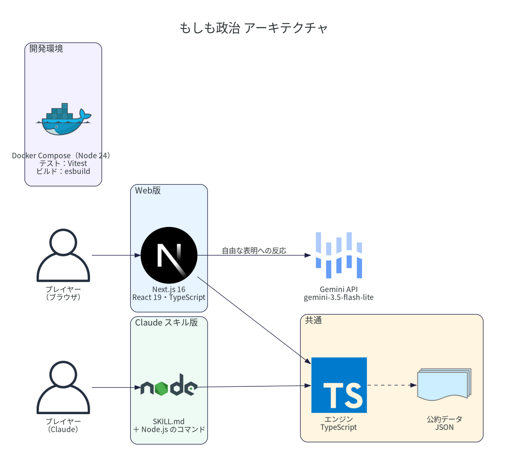

# 「もしも政治」設計書

最終更新：2026-09-26（モック `mock/index.html` の仕様に合わせて改訂。行動経済学・ゲーム理論のモデル、背景パターン、諸外国を追加）

## 1. コンセプト
- プレイヤーは2026年の日本の内閣総理大臣。少子高齢化・低成長・GDP比250%の債務を抱えた状態から始める。
- 政策は**自分の言葉で入力して表明**する（選択肢から選ぶのではなく、ユーザーが主体的に考える）。
- 街の住民（属性）や諸外国が、その場で吹き出しで反応し、支持率が動く。
- 支持率を保ち、**何年政権を維持できるか**を競う。

## 2. 参考にしたゲーム・プロダクト
| 参考 | 取り入れた点 |
|---|---|
| Frostpunk / Frostpunk 2 | 街そのものを主役にした画面。期限付きの「約束」（陳情に応える／断る）。危機の発生で街の様子が変わる |
| Tropico 6 | 街に住民が点在し、勢力ごとの支持が見える。陳情（勢力の要求） |
| Democracy 4 | 1ターン＝四半期、政治資本で政策を実行、属性（有権者グループ）ごとの支持率 |
| Suzerain | ターン開始時の新聞で状況を伝える |
| プロトコル・シェア（自作） | 自由入力に対してキャラクターが反応する会話型の進行。LLMの出力形式、モックモードの考え方 |

Reigns 式の2択カードは「政策はユーザーが主体的に考える」という方針に合わないため不採用。

### 2.1 類似ゲームの調査（2026年9月時点）
「政策を自由文で入力し、AIが国民・関係者の反応をシミュレートする」ゲームは、海外（米国が舞台）にすでに複数ある。

| タイトル | 仕組み | 舞台・言語 | 料金 |
|---|---|---|---|
| State Sandbox | AIが生成した架空の国で、自由文の行政命令を出すと波及効果をシミュレート。o1 / o1-mini のマルチエージェント構成。生成の遅さが課題とされる | 架空の国・英語 | — |
| Fantasy President Career | 自由文の政策に対し、24の有権者ペルソナ・32の利害関係者・50州が反応。議会・副大統領・危機・選挙あり | 米国・英語 | 月£5.99（初年度無料） |
| PlayPotus | 自由文の政策に、有権者・報道・上院が反応。スマホで1ターン約60秒、結果カードを共有できる | 米国・英語 | 無料（アルファ版） |
| BePOTUS | 閣僚とAI音声で通話して判断する | 米国・英語 | 未定（順番待ち） |
| Geo-Political Simulator 2026 / War and Politics | 本格的な国家運営シミュレーター（選択式が中心） | 世界各国・多言語 | 有料（Steam） |
| ニッポン征服／Pick Me Up! アイム総理／政治家になろう！ | 日本の総理・政治家もの。選択式やミニゲーム | 日本・日本語 | 無料〜 |

**本作の差別化**
- 日本が舞台で、日本語の自由文で遊べる（調べた範囲では、日本を舞台に自由文で遊べるAI政治シムは見当たらない）。
- 実在の日本の政党の直近の公約をデータとして持ち、比べながら遊べる。
- 行動経済学・ゲーム理論にもとづく反応モデル（4.4節）で、「なぜその反応になるのか」に筋が通っている。
- 街の住民が吹き出しで反応する、ゲームらしい見せ方。

Sources: [State Sandbox (Hacker News)](https://news.ycombinator.com/item?id=42866904), [Best AI President Simulator Games 2026 (Stork.AI)](https://www.stork.ai/blog/best-ai-president-simulator-games), [Fantasy President Career](https://fantasypresidentcareer.com/), [Geo-Political Simulator 2026 Edition (Steam)](https://store.steampowered.com/app/4021780/GeoPolitical_Simulator_2026_Edition/?l=japanese), [War and Politics (Steam)](https://store.steampowered.com/app/3421100/War_and_Politics/?l=japanese), [ニッポン征服 (App Store)](https://apps.apple.com/jp/app/id6743064514), [政治家になろう！ (unityroom)](https://unityroom.com/games/naro-seijika)

Sources: [Frostpunk Book of Laws](https://frostpunk.fandom.com/wiki/Book_of_Laws), [Frostpunk 2 Council](https://frostpunk.fandom.com/wiki/The_Council), [Tropico 6 Guide to Political Support](https://gameplay.tips/guides/4031-tropico-6.html), [Democracy 4 Basic Gameplay Guide](https://gameplay.tips/guides/8590-democracy-4.html), [Suzerain (Wikipedia)](https://en.wikipedia.org/wiki/Suzerain_(video_game))

## 3. 画面と遷移
```
タイトル ─┬─ 組閣する ─→ 就任（ワイプ）→ 新聞 → 官邸（メイン）
          ├─ 公約ブック（閲覧のみ）
          └─ 遊び方（モーダル）

官邸（メイン）── ターン終了 ─→ 新聞（次の四半期）→ 官邸 …
      │                 ├─ 支持率20%未満が2ターン連続 → 失脚
      │                 └─ 任期満了 → 選挙
      ├─ 政策ボタン → 公約ブック（「この政策を表明」で入力欄へ）
      ├─ 解散ボタン → 確認 → 選挙
      └─ ログボタン → 発言の記録（ドロワー）

選挙 ─┬─ 過半数 → 新聞 → 官邸（任期リセット）
      └─ 過半数割れ → 失脚
失脚 → もう一度組閣する → タイトル
```
- 画面遷移はすべてゲーム内の操作で行う（画面切替用のタブやボタンは置かない）。
- 遷移演出：斜めストライプのワイプ（就任・ターン終了・選挙・失脚）。

### 3.1 タイトル
- 背景に街の情景、ロゴ「もしも政治」、メニュー（組閣する／公約ブック／遊び方）、自己記録（最長在任・最高支持率・プレイ回数）。
- 遊び方のテキストは右寄せ。

### 3.2 新聞（ターン開始時）
- 題字「もしも新聞」、日付（年・四半期）、見出し（前ターンの表明内容）、リード文、情景写真、内閣支持率（前回比）、サブ記事3本（新しい危機・陳情があればその記事）。

### 3.3 官邸（メイン）
- **情景**：画面いっぱいに街のイラスト（横長16:9。画面幅が足りないときは横スクロール）。
- **住民マーカー**：街の中に属性ごとのアイコンを配置。
  - 支持率を持つ属性：丸いアイコン＋支持率の色付きリング＋表情アイコン。支持率25%未満で赤く揺れる。
  - 支持率を持たない人物（官房長官・記者クラブ）：四角いアイコン、リングなし。
  - ラベルは属性名のみ（氏名は出さない。支持率の数値も通常時は出さない）。
  - ホバーで「〇〇のいまの気持ち」の吹き出し：支持率に応じたセリフ（3段階）＋支持率バーと数値。陳情・危機を抱えている属性はその要求を話す。
  - 反応時は吹き出し＋支持率の増減（+5 / −9）がポップする。画面外の住民が話すと街が自動スクロール。
- **HUD（上部）**：日付・在任期間／内閣支持率ゲージ（20%の危険ライン付き、前回比）／政治資本（稲妻アイコン×5）・選挙までのターン数。
  - 内閣支持率のゲージにホバー（スマホはタップ）すると、属性ごとの支持率（国内は重み付き、低い順）、外国（米国・中国・諸外国）、政権の状態（信頼・連立との関係・財政のツケ）を一覧表示する。
- **危機・陳情カード（左上）**：後述。
- **政策入力欄（下部）**：「政策」ボタン（公約ブックを開く）、テキスト入力、「表明」ボタン（消費する政治資本を表示）。
- **総理会見**：表明した内容を入力欄の上に帯で5秒表示（総理大臣のマーカーは置かない）。
- **ターン終了ボタン**（右下の丸ボタン）、**ログ**・**解散**ボタン（左下）。
- 情景の説明（例「夕暮れの東京。まだ街は穏やかだ」）を切り替え時に表示。

### 3.4 公約ブック
- 政党タブ（党の色・衆院議席数・件数）＋「すべての政党」、分野タブ。
- 政党ごとに正式名・議席・与野党・出典・補足を表示。
- 各カード：党バッジ、分野、出典、タイトル、概要、支持率の予測変化、コスト、属性ごとの増減バー、反応人数。
- 官邸から開いた場合は「この政策を表明」ボタンで入力欄に反映して戻る。

### 3.5 選挙
- 議席の半円グラフ（465議席、政党別の色）、与党（自民・維新）合計と各党の議席、結果（過半数確保／過半数割れ）。

### 3.6 失脚
- 「失脚！」、理由、獲得称号、在任期間・スコア・最高支持率、歴代在任ランキング（ライバルはダミー）、もう一度組閣する／結果をシェア（準備中）。

## 4. ゲームシステム

### 4.1 ターン
- 1ターン＝四半期。開始は2026年Q4。
- ターン終了時の処理：
  1. 各国内属性の支持率に自然減（−1.2±1、若年女性・中小企業はさらに−0.5）
  2. 危機・陳情の期限を1減らし、期限切れはペナルティ（未回答の陳情は取り下げ）
  3. 政治資本を回復（支持率40%超なら+2、それ以外+1、上限5）
  4. 危機・陳情を抽選（1ターン目は陳情を必ず1件、以降は35%で発生なし）
  5. 失脚・選挙判定 → 新聞へ

### 4.2 属性と支持率
内閣支持率＝国内属性の支持率の加重平均。外国は内閣支持率に含めない。

| ID | 属性 | 重み | 初期値 | 街での話者 |
|---|---|---|---|---|
| yM / yF | 若年男性 / 若年女性 | 0.09 / 0.09 | 44 / 40 | 大学生 |
| mM | 中年男性 | 0.12 | 50 | 会社員 |
| mF | 中年女性 | 0.12 | 47 | 子育て世代 |
| oM / oF | 高齢男性 / 高齢女性 | 0.13 / 0.15 | 60 / 58 | 年金暮らし |
| big | 大企業 | 0.06 | 66 | 経済団体 |
| sme | 中小企業 | 0.10 | 45 | 商店街 |
| agr | 農林水産 | 0.05 | 62 | 農家 |
| uni | 労働組合 | 0.09 | 38 | 労働組合 |
| us / cn / as | 米国 / 中国 / 諸外国（EU・ASEAN・韓国などをまとめたもの） | — | 74 / 36 / 60 | アメリカ / 中国 / 諸外国 |

- 初期の内閣支持率は約51%。
- 不満ゲージは設けない（支持率のみで表す）。

### 4.3 政策の表明
1. プレイヤーが自由文で政策を表明する。
2. 公約データのキーワードに当てはまる政策を探す。複数当てはまる場合は、入力文に含まれるキーワードの文字数合計が最も大きい（＝具体的な）ものを採用し、同点は与党の公約を優先する。
3. 政治資本を消費（政策ごとに1〜3）。足りなければ官房長官が止める。
4. 関係する属性の代表が順に反応し（約1秒間隔）、支持率が変わる。
5. 同じ政策を2回表明すると、記者が「以前も伺いました」と返すだけで効果なし。
6. 同じ内容を公約に掲げる政党を「この政策の公約：〇〇党」として表示。野党の公約に沿った表明をすると、記者が「それは〇〇党の公約では？」と指摘する。
7. どれにも当てはまらない場合は、記者と会社員が具体性を求める（政治資本は消費しない）。

### 4.4 行動経済学・ゲーム理論のモデル
政策データの支持率変化（fx）は「素の値」とし、次の補正を通してから支持率に反映する。反応の吹き出しや数字は補正後の値を表示する。

**行動経済学**
| 効果 | 内容 | ゲームでの扱い |
|---|---|---|
| 損失回避（プロスペクト理論） | 同じ大きさなら、損は得より強く感じる | マイナスの変化を1.6倍にする |
| 組織化された少数者（オルソンの集合行為論） | 利害が集中した組織は声が大きい | 大企業・農林水産・労働組合の変化を1.3倍にする |
| フレーミング効果 | 同じ政策でも言い方で受け止めが変わる | 表明文に「支援」「投資」「未来」「守る」などがあればマイナスを0.85倍、「増税」「削減」「カット」などがあれば1.15倍 |
| 快楽順応（慣れ） | うれしさには慣れるが、痛みは残りやすい | 上がった支持の半分を「一時的な上昇」として記録し、毎ターン半分ずつ元に戻す。下がった分は戻らない |
| 現在バイアス（財政錯覚） | 効果は今、負担は後から見えにくく来る | 政治資本2以上の政策を表明するとその分「財政のツケ」がたまり、6に達したターンに国債格下げのニュースとともに大企業・現役世代・高齢層の支持が下がる |
| バンドワゴン効果／沈黙の螺旋 | 支持は支持を呼び、不支持は離反を呼ぶ | 毎ターン、内閣支持率55%超なら全属性+0.4、30%未満なら−0.4 |

**ゲーム理論**
| 考え方 | ゲームでの扱い |
|---|---|
| 繰り返しゲームと評判 | 「政権への信頼」（0〜100、初期50）を持つ。約束を守る+12、危機に対応+5、約束を破る−15、危機を放置−8、陳情を断る−2、同じ話の繰り返し（安い約束）−3。信頼が高いほど、プラスの反応が大きく受け取られる（0.6〜1.4倍） |
| 連立の交渉ゲーム | 連立相手（維新）との関係（初期60）を持つ。維新の公約を表明+8、自民の公約+1、野党の公約−6。25未満で連立離脱し、選挙で維新の議席が与党から外れ、与党の議席が1割減る |
| 外交の囚人のジレンマ（しっぺ返し戦略） | 米国の関税通告に「報復」「対抗」で応じると、米国は報復関税の拡大で返す（次のターンに新たな危機が発生）。「交渉」「協議」など協調で応じると解決する |
| 投票率の差（中位投票者） | 選挙の得票は投票率で重み付けする（若年45%、中年60%、高齢70%前後、組織票65〜72%）。高齢層の支持が選挙に効きやすい |

- 公約ブックの「支持率（即時の予測）」も、損失回避と組織の補正を通した値で表示する。
- これらの数値はゲームバランス用の仮定であり、学術的な推定値ではない。

### 4.5 危機と陳情（期限付きの約束）
| 種類 | 内容 | 操作 |
|---|---|---|
| 危機 | 台風直撃（背景：災害）、米国の関税通告（背景：緊張）、円安（背景：停滞）。関税に報復すると「報復関税の拡大」が続けて発生 | 期限内に関連する政策を表明すると解決 |
| 陳情 | 家賃補助、待機児童ゼロ、年金引き上げ、最低賃金1500円 | 「約束する」で関係属性+3、期限内に表明で達成。「断る」でペナルティの半分 |

- 達成：該当属性の支持率が上がる。期限切れ：該当属性の支持率が下がり、次のターン開始時に「約束、破りましたね」と責められる。
- 危機が発生している間は背景が危機のものに変わる。

### 4.6 背景パターンの差し替え
背景はターンごとに生成せず、**事前に用意した7パターン**を状況に応じて差し替える。画像生成用のプロンプトは [background_prompts.md](background_prompts.md)。

| 条件（上から優先） | 背景 |
|---|---|
| 危機が発生中 | 危機ごとの背景（災害／緊張／停滞） |
| 内閣支持率 < 25% | 荒廃（夜の官邸前に抗議の群衆） |
| 米国 < 30 または 中国 < 20 | 緊張（湾の沖合に艦影） |
| 内閣支持率 < 38% | 停滞（曇天、閉まった店） |
| 都市化の度合い ≥ +4 | 都市化（高層ビルとクレーン） |
| 都市化の度合い ≤ −4 | 地方化（山並み、田畑、木々） |
| それ以外 | 順調（夕暮れの穏やかな街） |

- 「都市化の度合い」（−10〜+10）は、表明した政策で動く。成長投資・エネルギー・AI・半導体・再開発で+2、農業・防災・地方・移住で−2。
- モックでは7パターンをSVGで描き分けている。本番は7枚の画像に差し替える（住民アイコンの位置と合うよう、7枚とも構図をそろえる）。

### 4.7 選挙
- 衆院の任期満了は2030年2月（開始から13ターン後）。ゲーム内最初の選挙は第52回。
- 「解散」でいつでも選挙を行える。
- 与党議席＝465 ×（0.2 ＋ 投票率で重み付けした支持率×0.008 ± 0.02）、範囲は20%〜72%。233議席以上で過半数。連立離脱後は与党議席を1割減らす。
- 与党分は自民・維新（連立離脱後は自民のみ）、野党分は各党に、2026年衆院選の議席比で配分。
- 勝利すると任期リセット（16ターン）、政治資本が満タン。

### 4.8 失脚条件とスコア
- 内閣支持率が2ターン連続で20%未満 → 内閣総辞職
- 選挙で与党が過半数割れ → 政権交代
- スコア＝在任ターン数×100＋最高支持率×10
- 称号：1年未満「1年もたない短命宰相」、消費税を上げていた「増税に散った宰相」、選挙敗北「民意に敗れた宰相」、5年以上「長期政権の宰相」、それ以外「志半ばの宰相」
- 記録（最長在任・最高支持率・プレイ回数）は localStorage に保存（try/catch）。

## 5. 公約データ
| ファイル | 内容 |
|---|---|
| `data/policies.json` | 公約60件。自民党15件（2025年参院選公約、2026年衆院選公約、2026年2月施政方針）は反応のセリフを個別に作成。自民党以外の10政党45件（主に2026年2月の第51回衆院選） |
| `data/parties.json` | 11政党の基本情報と出典 |
| `data/game.json` | 属性・補正の係数・選挙・話者・危機と陳情・その他の政策などのパラメータ |

- 政党の状況は2026年9月26日時点。
  - 第51回衆院選の議席：自民316、中道改革連合49、維新36、国民民主28、参政15、チームみらい11、共産4、れいわ1、減税日本・ゆうこく連合1、社民0、日本保守党0。
  - 中道改革連合は2026年9月に分裂し、公明党系の議員は公明党に復党、立憲系の議員は新党「民主改革の会」を結成（衆院では「中道」会派）。両党の独自公約がまだないため、衆院選時の中道改革連合の公約を「中道」として扱う。
  - 減税日本・ゆうこく連合は公約データ未収録。
- 政策1件の項目：`id / party / cat（分野）/ icon / source / title / summary / keywords（正規表現）/ cost / fx（属性ごとの支持率変化）`。自民党は `reactions`（話者・感情・セリフ・変化）を持つ。
- 自民党以外の反応セリフは、fx の大きい属性から最大4人分を、属性ごとの定型文（喜・安・怒・疑など4種）で組み立てる。コスト2以上なら記者が財源を問う。
- **fx・cost・反応はゲーム用の仮定であり、実際の世論や政策効果を示すものではない**（データとUIの両方に明記）。

出典：[日経 衆議院選挙2026 各政党の公約一覧](https://www.nikkei.com/special/election/manifesto)、[政治データベース 政党公約比較](https://seiji-db.jp/manifestos/)、[Pontaコラム 各党の公約比較](https://column.finance.ponta.jp/archives/680/)、[自民党 参院選公約2025](https://www.jimin.jp/election/results/sen_san27/political_promise/)、[高市内閣 施政方針演説](https://www.kantei.go.jp/jp/105/statement/2026/0220shiseihoshin.html)、[第51回衆議院議員総選挙](https://ja.wikipedia.org/wiki/%E7%AC%AC51%E5%9B%9E%E8%A1%86%E8%AD%B0%E9%99%A2%E8%AD%B0%E5%93%A1%E7%B7%8F%E9%81%B8%E6%8C%99)、[中道改革連合](https://ja.wikipedia.org/wiki/%E4%B8%AD%E9%81%93%E6%94%B9%E9%9D%A9%E9%80%A3%E5%90%88)

## 6. UI・トンマナ
- ゲームらしさを優先。和の要素や「AIが作った感」の出る表現（絵文字、金のグラデーション、発光）は使わない。
- 太い紺色の輪郭線（3px）、硬い影（下5px）、角丸パネル、押すと沈むボタン。
- 色：紺 `#1f2244`（線・文字）、クリーム `#fff5e1`（パネル）、黄 `#ffc93c`（主ボタン・政治資本）、コーラル `#ff6b57`（ターン終了・悪化）、ミント `#35cfa1`（支持率・改善）、空色 `#5ab4ff`、紫 `#8c6cf2`。政党は党ごとの色。
- 書体：見出し Dela Gothic One、本文 M PLUS Rounded 1c、数字 Rubik（Google Fonts）。
- アイコン：Font Awesome 6（CDN）。表情も Font Awesome の顔アイコンで表す。
- 街のイラスト：輪郭線付きのフラットなイラスト。動きは控えめ（タワーの航空灯の点滅、船の上下2〜4px、工場の薄い煙）。

### 6.1 レスポンシブ
- PC（1280〜1440px幅）：街を全幅表示、入力欄は中央。
- スマホ（760px以下）：
  - HUD を2段にまとめる。
  - 街の表示領域を入力欄の上までにし、住民が入力欄に隠れないようにする（横スワイプで街を見る）。
  - 通知は画面下寄り（総理会見の帯の上）に出す。
  - 陳情カードの余白を詰める。
  - 公約ブックの政党タブ・分野タブは横スクロールの1行。

## 7. 構成と確認方法



図は `docs/architecture/architecture.py`（Python の diagrams）から作る。構成を変えたら `docker compose run --rm diagrams` で描き直す。

```
moshimo-seiji/
  data/                       # 公約・政党・パラメータ（JSON。正本はここだけ）
  engine/                     # 計算ロジック（TypeScript）とテスト
  web/                        # Web版（Next.js）
  skill/                      # Claude スキル版（SKILL.md とコマンドのソース）
  scripts/build_skill.sh      # スキル版のビルドと zip 作成
  docs/architecture/          # アーキテクチャ図（diagrams のスクリプトと PNG、描くための Dockerfile）
  Dockerfile, compose.yaml    # 開発環境
  mock/index.html             # 最初のモック（画面・ロジック・情景SVGを1ファイルに収めたもの。Web版に移し終えたら消す）
  mock/data -> ../data        # モックもJSONを読む
  docs/design.md              # 本書
  docs/progress.md            # 進捗と引き継ぎ
  docs/background_prompts.md  # 背景7パターンの画像生成プロンプト
  docs/promo_x_4koma.md       # X予告用の4コマ（日常ストーリーと画像プロンプト）
```
- Web版：ルートで `docker compose up`、http://localhost:3000 を開く（開発環境は Docker。Node 24）。Claudeのプレビューからは `.claude/launch.json` の `moshimo-web`。
- モック：`.claude/launch.json` の `moshimo-mock`（`python3 -m http.server 8933 --directory mock`）。HTMLを直接開く（file://）方式ではデータが読み込まれない。
- テスト：`docker compose exec web npm test`。

### 未実装・仮のもの
- 自由な表明への反応は Gemini（Web版のみ。モックはキーワードでの決め打ち）。
- 背景は7パターンのSVG（本実装は事前に生成した7枚の画像）。
- 予算・外交・閣僚・世論調査の画面、結果のシェアは未実装。
- 歴代ランキングのライバルはダミー。

## 8. 本実装に向けて（未決定を含む）
- **反応の生成（LLM）**：Gemini API（既定 `gemini-3.5-flash-lite`）を使う。公約・その他の政策に当たらない自由な表明にだけ使い、公約に当たる表明はデータの反応を使う。
  - 表明文と属性ごとの支持率を渡し、JSON（`isPolicy`, `title`, `cat`, `cost`, `reactions[{who, emo, text, fx}]`）で返させる。
  - 返ってきた値はエンジンの `sanitizeFreeform` で範囲に収め（1行±10、5行まで、コスト1〜3）、支持率の計算はエンジンで確定させる。
  - 政策でない文、キーがない、呼び出しに失敗した、のどれかなら、記者が聞き返すだけにする（モックモード）。
- **背景画像**：ターンごとの生成はやめ、事前に生成した7パターンを差し替える（4.6節）。生成コストと待ち時間がかからず、見た目も安定する。
- **構成**：1つのリポジトリで、公約データ（`data/`）と計算ロジック（`engine/`、TypeScript）を Web版とClaudeスキル版で共有する。
  - Web版は Next.js（App Router + API Routes）。エンジンはブラウザで動かし、Gemini のキーはサーバー側（API Route）だけに置く。
  - スキル版は、エンジンと `data/*.json` を1ファイルのJS（`moshimo.mjs`）にまとめて `node` で動かし、状態を `moshimo_state.json` に保存する。公約に当たらない表明への反応は Claude が作る。ルールと出力の形は Gemini と同じもの（`engine/src/freeform.ts`）を使う。
- **ゲームロジック**：状態更新・失脚判定・選挙計算を `engine/` の純粋な関数にまとめ、テストでバランスを確認する（何もしないと数年で失脚する程度を目安にする。今は9割以上が5年以内に失脚）。
- **公約データの更新**：選挙や政党の再編があれば `data/parties.json` と `data/policies.json` を更新する。公明党・民主改革の会の独自公約が出たら差し替える。
